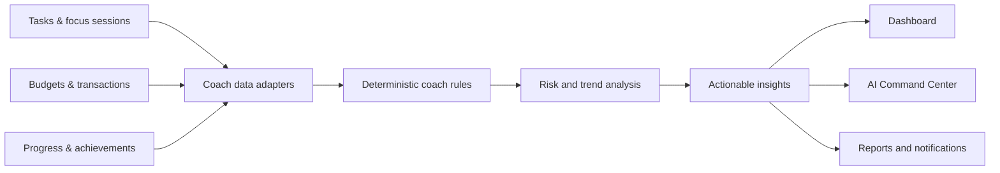
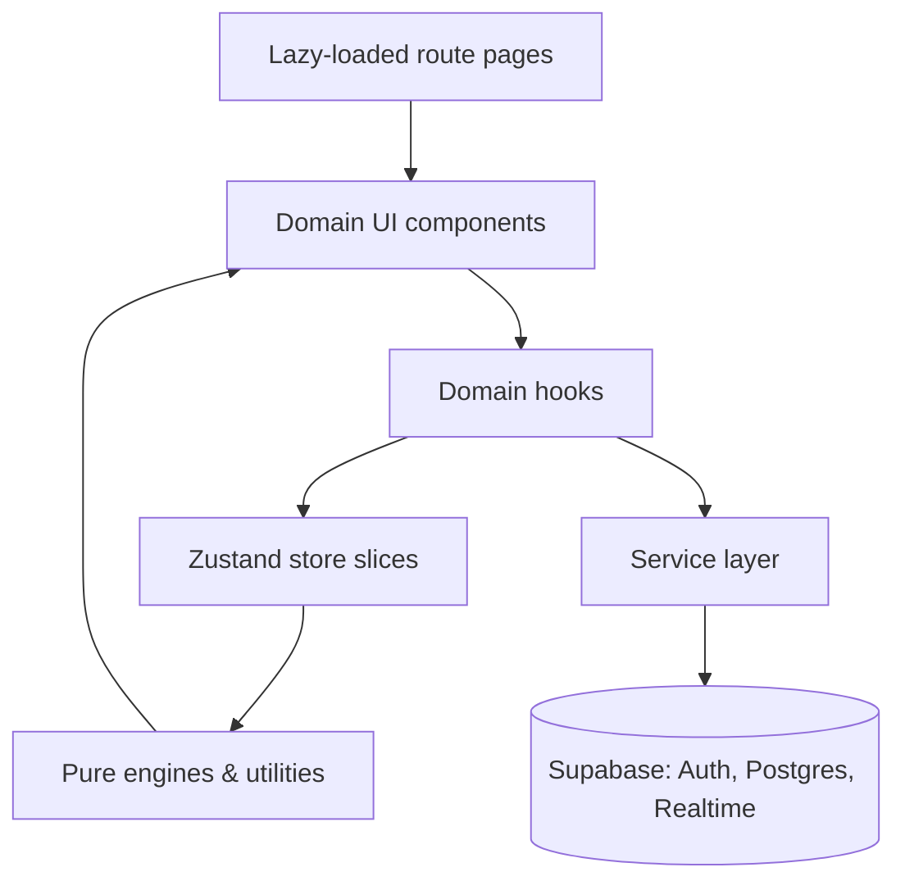
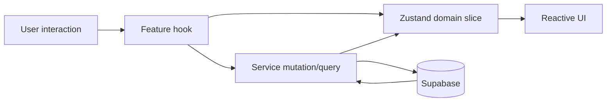

# ⚡ FocusForge

<div align="center">

### Forge better habits. Master your productivity. Control your finances.

*A unified operating system for focused work, intentional planning, financial clarity, and sustainable personal growth.*

[](https://react.dev/)
[](https://www.typescriptlang.org/)
[](https://vitejs.dev/)
[](https://tailwindcss.com/)
[](https://supabase.com/)
[](LICENSE)

</div>

---

## Overview

FocusForge brings the tools that shape a productive life into one focused workspace: task planning, Pomodoro sessions, budgeting, expense tracking, analytics, gamification, and social accountability. Rather than making people reconcile several disconnected apps, it connects daily actions to meaningful progress across work and money.

The application is designed for students, professionals, and builders who want a clear picture of what they should do next, how they are spending their attention, and how their habits are changing over time.

### Why FocusForge?

- **One daily command center** for tasks, focus, finances, progress, and actionable insights.
- **Motivation with context** through XP, levels, achievements, streaks, and competitive challenges.
- **Private, practical intelligence** from a deterministic and localized AI Coach Engine that turns application data into understandable recommendations.
- **A resilient experience** built around typed domain state, isolated data services, and responsive, accessible interface patterns.

## Screenshots

> Add exported product screenshots to `docs/screenshots/` and replace the placeholders below before publishing.

| Dashboard | Focus & tasks |
| --- | --- |
|  |  |

| Finance | Command Center |
| --- | --- |
|  |  |

## Feature matrix

| Area | What it provides |
| --- | --- |
| **Dashboard** | A daily home with greeting, key metrics, progress indicators, smart insights, widgets, and quick-add actions. |
| **Tasks** | Task capture, organization into sections, priorities, due dates, recurrence support, completion flow, and a productivity view of planned work. |
| **Focus** | A Pomodoro-style timer that supports intentional work and break cycles, session tracking, and a direct link between focus time and progress. |
| **Finance** | Expense and income tracking, budgets, categories, period summaries, transaction workflows, and a clear view of personal cash flow. |
| **Analytics** | Trends and performance signals across focus, tasks, habits, and finances to help users understand changes over time. |
| **AI Coach** | Deterministic, localized recommendations, behavioral trends, risk signals, and next-step guidance generated from the user’s own application data. |
| **AI Command Center** | A dedicated workspace for reviewing AI-led signals, prioritizing actions, and turning insights into decisions. |
| **Reports** | Executive-style rollups that bring productivity and financial activity into concise, reviewable summaries. |
| **Notifications** | A centralized notification center for timely updates, reminders, achievement moments, and important account activity. |
| **Gamification** | XP, levels, achievements, progress feedback, and streak-oriented mechanics that reward consistent effort. |
| **Arena** | A competitive productivity space with leaderboards and challenge-oriented social motivation. |
| **Friends & social** | Friend connections and collaborative accountability, including social interactions and bill-splitting workflows where enabled. |
| **Profile & settings** | Personal preferences, application configuration, and account-oriented controls. |
| **Authentication** | Secure account access and session-aware product experiences backed by Supabase Auth. |

## AI Coach Engine

FocusForge’s AI layer is deliberately designed as a product intelligence engine, not a generic chat box. It evaluates application signals—such as completion patterns, focus behavior, budgets, spending categories, and streaks—and returns explainable, localized guidance.

Typical insight categories include:

- **Focus and workload:** patterns in planned versus completed work, session consistency, and potential overload.
- **Financial health:** budget pressure, spending-category movement, and actionable financial risks.
- **Behavioral trends:** habit momentum, changes in consistency, and opportunities to preserve a positive streak.
- **Personalized next actions:** concise suggestions chosen from the user’s current state rather than a one-size-fits-all script.



The deterministic approach keeps feedback predictable, testable, and grounded in product data. It can evolve over time without making the essential experience dependent on an external generative model.

## AI Command Center

The Command Center is the operational surface for the intelligence layer. It gathers high-signal recommendations and helps users move from observation to action: review what needs attention, understand the signal behind it, and decide what to change next.

It complements the Dashboard’s glanceable insights with a dedicated environment for deeper review—especially useful during weekly planning, budget checks, and productivity retrospectives.

## Architecture

FocusForge follows a domain-oriented React architecture. Pages compose domain components; hooks encapsulate lifecycle and behavioral logic; Zustand holds client-side domain state; services isolate Supabase interactions; and `lib/` contains pure utilities and engines.



### Design principles

- **Domain boundaries over page-sized logic:** UI, data access, state, and calculation concerns are separated.
- **Typed at every boundary:** TypeScript interfaces make state, service responses, and component contracts explicit.
- **Composable product surfaces:** reusable UI primitives support consistent domain-specific experiences.
- **Backend isolation:** components do not need to know query details; services own database interactions.
- **Progressive loading:** top-level routes are lazy-loaded to limit initial bundle cost.

## Project structure

```text
src/
├── components/              # Reusable UI and domain-specific interface pieces
│   ├── arena/               # Competitive and leaderboard experiences
│   ├── dashboard/           # Dashboard widgets and daily overview
│   ├── finance/             # Budgeting and transaction interfaces
│   └── ui/                  # Shared, atomic UI primitives
├── hooks/                   # Lifecycle, state, and domain behavior hooks
│   ├── useArenaEngine.ts
│   ├── useCoach.ts
│   └── useTimerEngine.ts
├── lib/                     # Pure functions, engines, integrations, utilities
│   ├── coach/               # AI Coach calculations and recommendation logic
│   └── supabase.ts          # Supabase client configuration
├── pages/                   # Lazy-loaded route-level views
│   ├── Dashboard.tsx
│   ├── Finance.tsx
│   └── CommandCenter.tsx
├── services/                # Backend query and mutation boundaries
│   ├── arenaService.ts
│   └── friendService.ts
├── store/                   # Zustand global store and domain slices
│   ├── authSlice.ts
│   ├── financeSlice.ts
│   └── types.ts
└── ...
```

> The tree is an architectural guide. Consult the repository for the complete, current file list.

## State management

Zustand provides a lightweight global state layer organized by domain slices. This keeps feature state close to its business area while allowing the Dashboard, page routes, widgets, and global controls to work from a consistent source of truth.



Use local component state for temporary presentation concerns. Promote state to a store slice when multiple parts of the application need a durable, shared domain view.

## Data and backend overview

Supabase provides the backend foundation: authentication, PostgreSQL persistence, and product data access. The service layer acts as the bridge between frontend domains and backend resources.

| Data domain | Representative records |
| --- | --- |
| Identity | User profile, account preferences, authenticated session |
| Productivity | Tasks, task sections, recurrence data, focus sessions, completion history |
| Finance | Transactions, categories, budgets, budget periods, summaries |
| Progress | XP events, levels, achievements, streak-related progress |
| Social | Friend relationships, arena participation, leaderboard data, bill-splitting records |
| Intelligence | Derived coach inputs, insight state, notifications, report-ready aggregates |

For a production deployment, enforce Row Level Security (RLS) on all user-scoped tables, make ownership columns explicit, and expose only narrowly scoped RPCs or views for aggregate workflows.

## Technology stack

| Layer | Technology |
| --- | --- |
| Frontend | React 18, TypeScript, Vite |
| Styling | Tailwind CSS and reusable UI components |
| Client state | Zustand, organized into domain slices |
| Backend | Supabase Auth and PostgreSQL |
| Data access | Typed service modules and Supabase client wrapper |
| Product intelligence | Local, deterministic Coach Engine and analytics utilities |
| Quality foundations | Lazy routes, reusable hooks, responsive layouts, accessible UI patterns |

## Performance

FocusForge is structured to keep the product responsive as its feature set expands.

- **Lazy-loaded page routes** reduce the cost of the first render.
- **Domain-level component boundaries** help keep rendering and change scope focused.
- **Reusable hooks** centralize timer, arena, coach, and lifecycle logic instead of duplicating it across screens.
- **Pure calculation utilities** make analytics and coach logic easier to test and optimize independently of rendering.
- **Service isolation** avoids coupling components directly to backend-query implementation details.

Measure production performance with your deployment platform’s Web Vitals tooling and browser profiling before making optimization claims or tradeoffs.

## Reliability and privacy

- Service modules create a single place to handle backend failures, response shaping, and retry or recovery behavior.
- Typed state and service contracts reduce the chance of invalid data reaching product surfaces.
- Authentication-aware flows keep protected experiences aligned with the user session.
- Supabase RLS should be enabled and tested for every user-scoped data path.
- The Coach Engine is localized and deterministic, so its recommendations remain inspectable and do not require transmitting behavioral data to a third-party LLM service.

## Accessibility

FocusForge aims to make daily planning and finance management usable for more people.

- Responsive layouts support desktop and smaller screens.
- Shared UI primitives promote consistent controls and interaction patterns.
- Semantic controls, visible focus states, keyboard navigation, labels, and sufficient contrast should be validated for each shipped page.
- Timer, status, notification, and chart changes should have appropriate text alternatives and non-color-only cues.

Run automated accessibility checks and manual keyboard/screen-reader reviews as part of release readiness; accessibility is a continual quality practice, not a one-time checkbox.

## Getting started

### Prerequisites

- Node.js 18 or later
- npm, pnpm, or yarn
- A Supabase project

### Installation

```bash
git clone https://github.com/<your-github-user>/focusforge.git
cd focusforge
npm install
cp .env.example .env.local
npm run dev
```

Open the local address printed by Vite, commonly `http://localhost:5173`.

### Available scripts

| Command | Purpose |
| --- | --- |
| `npm run dev` | Start the local development server. |
| `npm run build` | Create an optimized production build. |
| `npm run preview` | Preview the production build locally. |
| `npm run lint` | Run configured lint checks, when available. |
| `npm run test` | Run configured tests, when available. |

> Check `package.json` for the authoritative script list in your checkout.

## Environment variables

Create `.env.local` from `.env.example` and provide only public, browser-safe values prefixed with `VITE_`.

```dotenv
# Public Supabase project settings (safe to expose in a frontend build)
VITE_SUPABASE_URL=https://your-project.supabase.co
VITE_SUPABASE_ANON_KEY=your-supabase-anon-key
```

Never place a Supabase `service_role` key, database password, or other privileged secret in a Vite environment variable. Keep privileged operations in secure server-side or Supabase Edge Function code.

## Database setup

1. Create a Supabase project.
2. Apply the repository’s schema migrations, policies, functions, and seed data in their intended order.
3. Enable and test RLS for every table exposed to the client.
4. Configure redirect URLs for local development and your deployed domain in Supabase Auth.
5. Add the public project URL and anon key to `.env.local`.

If this repository includes SQL migrations, treat them as the authoritative schema documentation rather than maintaining a separate, drifting SQL copy in this README.

## Deployment

FocusForge can be deployed to any static hosting platform that supports Vite builds, such as Vercel, Netlify, or Cloudflare Pages.

1. Connect the repository to your host.
2. Use the build command `npm run build` and publish directory `dist`.
3. Add `VITE_SUPABASE_URL` and `VITE_SUPABASE_ANON_KEY` in the host’s environment settings.
4. Add the deployed URL to Supabase Auth redirect URLs.
5. Verify sign-in, protected routes, database policies, and production error states after deployment.

## Roadmap

- [ ] Add real product screenshots and a short guided demo.
- [ ] Publish a complete ERD/schema reference generated from migrations.
- [ ] Expand automated unit, integration, and end-to-end test coverage.
- [ ] Add release notes and a public changelog.
- [ ] Enhance exportable executive reports.
- [ ] Continue accessibility audits across every feature path.
- [ ] Evolve Coach insights with opt-in, privacy-conscious personalization controls.

## Contributing

Contributions are welcome. For meaningful changes, please:

1. Open an issue or discuss the change first when the scope is large.
2. Create a focused branch using the `codex/` prefix where applicable.
3. Keep UI, domain state, service, and utility responsibilities separated.
4. Add or update tests and documentation with behavior changes.
5. Run the relevant checks before opening a pull request.
6. Describe user impact, implementation notes, and verification steps in the PR.

### Developer notes

- Put reusable UI building blocks in `src/components/ui/`; keep feature-specific UI in its domain folder.
- Put backend calls behind `src/services/`, not inside components.
- Prefer custom hooks for non-trivial effects, timers, subscriptions, and reusable domain orchestration.
- Keep Coach and analytics calculations pure whenever possible so they are easy to test.
- Keep new global state inside the appropriate Zustand slice, with explicit TypeScript types.
- Treat user financial and behavioral data as sensitive: use least-privilege access, validate assumptions, and test RLS policies.

## License

Distributed under the MIT License. See [LICENSE](LICENSE) for details.

---

<div align="center">
  Built with focus for people building a more intentional life.
</div>
